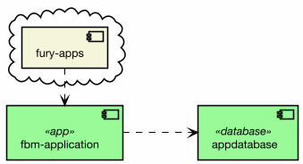

# FBM-APPLICATION TECHNICAL SPEC {docsify-ignore}

## Overview {docsify-ignore}

***TODO: Complete the information of the real details of this app.***

- This application is implemented as a set of REST JSON operations. 
- All data is stored in a single MySQL database.
- All operations return a status code 500 in case of unexpected error. 
- Data consistency is achieved by using database transactions.

